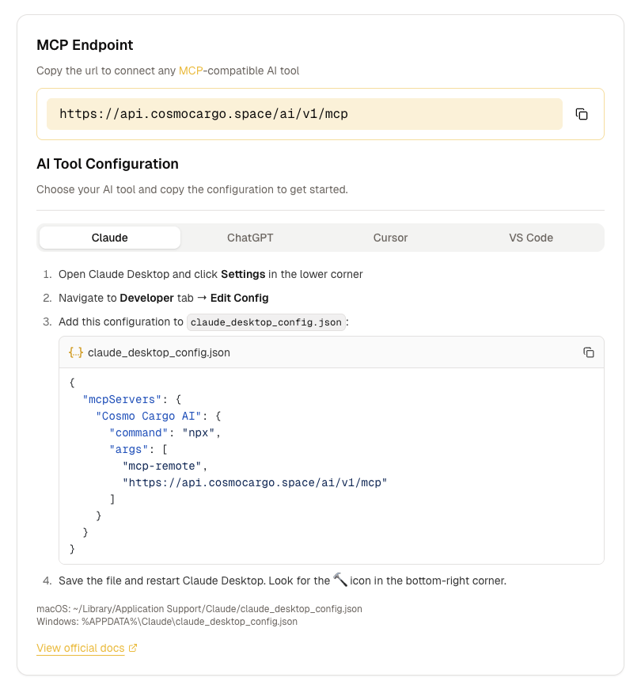

# 🔌 MCP App Instructions

## 🌟 What Is This?

`mcp-app-instructions` is a TypeScript library that generates step-by-step installation instructions for connecting various tools with MCP support to your MCP server. Whether your users are rocking Claude Desktop, ChatGPT, Cursor, or VS Code, we've got them covered.

## 🤔 Why Does This Exist?

Because writing documentation is hard. Writing _good_ documentation is harder. MCP is moving fast and there is always another tool or changes in how you do it. This repository is a collection of instructions for various tools with MCP support. You can use it to generate instructions for your own tool or use it as a reference for your own documentation. It's open source so we can work together to keep it up to date with the latest changes in MCP.

## Example



## 🚀 Features

- 📝 **Pre-written instructions** for popular tools with MCP support
- 🎨 **Dynamic configuration generation** with your server details
- 🔗 **Deep links** for one-click installation (where supported)
- 💡 **Helpful hints** and warnings for special requirements
- 📦 **Code snippets** ready to copy-paste
- ✨ **Type-safe** because we're not monsters

## 📦 Installation

```bash
npm install mcp-app-instructions
```

Or if you're fancy:

```bash
pnpm add mcp-app-instructions
# yarn add mcp-app-instructions
# bun add mcp-app-instructions
```

## 🎯 Usage

### Basic Usage (TypeScript/JavaScript)

```typescript
import { getMcpServerInstructions } from "mcp-app-instructions";

const instructions = getMcpServerInstructions({
  name: "MyAwesomeMCP",
  url: "https://api.myserver.com/mcp",
});

// Returns an array of configurations for:
// - Claude Desktop
// - ChatGPT
// - Cursor
// - VS Code

console.log(instructions);
```

### React Component

We've also got a React component that renders the instructions with a nice UI:

```tsx
import { McpInstructions } from "mcp-app-instructions";

function MyApp() {
  return (
    <McpInstructions name="MyAwesomeMCP" url="https://api.myserver.com/mcp" />
  );
}
```

The component displays:

- ✅ All platform instructions in an organized layout
- 📋 Formatted code snippets with syntax highlighting hints
- 🔗 Official documentation links
- ⚠️ Important hints and requirements
- 🎯 Deep links for one-click installation (where available)

### What You Get Back

Each configuration includes:

```typescript
{
  name: string;                    // e.g., "Claude", "Cursor"
  description?: string;            // Optional description
  officialDocsLink: string;        // Link to official docs
  installDeepLink?: {              // One-click install (if supported)
    link: string;
    label: string;
  };
  hint?: {                         // Important notes or warnings
    type: "info" | "warning";
    title?: string;
    text: string;
  };
  steps?: {                        // Installation steps
    text: string;
    files?: {                      // Config files to create
      name: string;
      content: string;
      language: "json" | "typescript";
    }[];
  }[];
}
```

## 🎪 Supported Platforms

| Platform          | Status       | One-Click Install |
| ----------------- | ------------ | ----------------- |
| 🤖 Claude Desktop | ✅ Supported | ❌                |
| 💬 ChatGPT        | ✅ Supported | ❌                |
| ⚡ Cursor         | ✅ Supported | ✅                |
| 🆚 VS Code        | ✅ Supported | ❌                |

## 💡 Want to Add More Platforms?

PRs are welcome! If there's another AI assistant or IDE that supports MCP servers, we'd love to add instructions for it.

---

Made by the [Zuplo team](https://zuplo.com) 💖 for [Zudoku](https://zudoku.com) & [Zuplo MCP Gateway](https://zuplo.com/docs/handlers/mcp-server).
